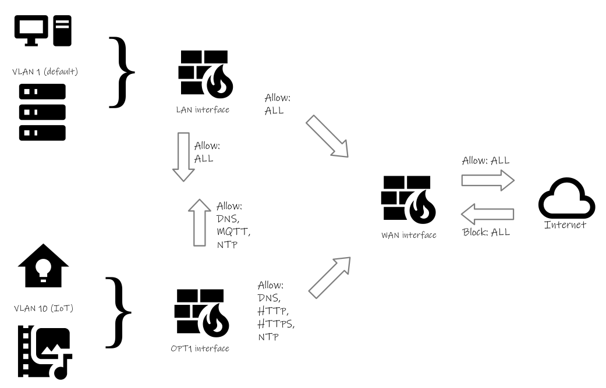

# Defining IoT Firewall Rules
Now that I have a separate network segment for IoT devices, with my OPNSense firewall in the middle, it's time to think about firewall rules and what devices go where. I.T. Security is not my specialty, so I'm using a combination of internet research, things I've picked up from the I.T. security pros at work, and common sense. Everyone's setup is unique, so do what's right for you and don't take this guide as the last word on IoT security.

## Overview
Here's a peek at the resulting firewall configuration. The explanation of how I got here follows.



_Figure 1: A visual representation of rules governing network traffic_

## Classifying Devices
Before any firewall rules are created, the first step is to determine which of my devices belong on the IoT network segment and which ones belong on the default network. This seems like it should be pretty easy. Is it an IoT device? Put it on the IoT network. But what about Home Assistant, my home automation hub? Where does it belong? Does it go on the IoT network with the devices it interacts with or, being a server, should it reside with the other servers on the default network?

To determine which devices go where, I asked myself two questions:
1. Does it run an operating system that gets regular patches and updates?
2. Does it store any personally identifiable information (name, address, bank account numbers, etc.)?

If the answer is yes to both of these questions, the device should be on the default network. If the answer is no to both, it goes on the IoT network. If there's one yes answer and one no answer, it needs closer examination.

Using this criteria, I can already answer the question of where to put my Home Assistant server. It runs as a Docker container on a recent version of Linux, so question one is a yes, it gets regular patches and updates. And for question two, it has my name with my login account, and my approximate address to provide accurate weather information. It also tracks my home and away status to put the thermostat in energy saving mode. So there's definitely some personally identifiable information there.

Going through this process with the other devices on my network, I was able to classify them relatively easily. Here's what I came up with:

### Default Network (regular patches & updates, and personal information)
* PCs and laptops
* Mobile phones uing WiFi connection
* Nextcloud and other network attached storage

### IoT Network (unreliable patch & update schedule, and no personal information)
* TV & home theater receiver, and streaming devices
* Video game consoles
* Smart thermostat
* WLED lighting
* Solar inverter

## Determining Communication Requirements
Now that I know on which network segment devices are going to be located, I need to figure out what kind of access they need to get their job done. Do they need to talk to other devices on the local network? Do they need to talk to the internet (cloud)?

Here's what I determined:
* Many of my home automation devices provide a REST API (HTTP based) for the home automation hub to _pull_ data.
* Some home automation devices use MQTT to _push_ their data.
* One device (the solar inverter) is cloud connected.
* The solar inverter does not always contact the same IP address when it uploads its data.
* Nearly all devices (IoT as well as PCs, laptops, and phones) need access to DNS servers.
* Several devices synchronize their realtime clocks using NTP to one or more internet-based time servers.
* Devices that get regular patches and updates do so using HTTP/HTTPS.
* The PC, laptop, and mobile phone users are used to having unfettered access to the internet.

## Translating Communication Requirements into Firewall Rules
Now that I know the access required by each type of device, I can begin creating firewall rules to enable that access. In most cases, I want to give the minimum level of access required for a device to do its job. But, I don't want to be bogged down with a large number of firewall rules that I have to maintain.

To this end, I'll be adding rules that apply equally to all devices on a particular network segment. Again, these networks are:
* The default VLAN for regularly updated devices (PCs, laptops, servers, and mobile phones) that store personal information.
* The IoT VLAN for devices that may not get regular security updates, but don't store any personally identifiable information.

The first rule I identified is an "allow all" rule from the trusted devices on the default VLAN to the IoT VLAN. In this case though, there's actually nothing to do, because OPNSense does not block traffic between Interfaces. Only traffic inbound from the WAN (internet-facing) interface is blocked.

This allows Home Assistant, sitting on my default VLAN, behind the LAN interface, to access any REST APIs (or anything else for that matter) on the IoT network. Unfortunately, this same behavior means the IoT network devices can access whatever they want on the default network behind the LAN interface. So my first task is to stop the unrestricted flow from the IoT network.

The following rule will do that:
```
Action: Reject
Protocol: IP4+6*
Source: OPT1 net
Destination: OPT1 address
```

This rule should do the trick, but I'll feel more confident if I can try it and see. So for testing, I can temporarily attach a spare Raspberry Pi to the IoT network. I should be able to make an SSH connection from my laptop (on the default network) to the Raspberry Pi (on the IoT network.) However, when trying to SSH from the Raspberry Pi to something else (say, the Home Assistant server), my attempt should be blocked because of the rule above. If this test is sucessful, I can be reasonably confident my first firewall rule is doing its intended job.

Now that the IoT network segment is isolated, I can start letting things through as needed. To keep things simple, I'll be allowing traffic by destination port number.

Here's a rule to allow DNS lookups from the IoT network:
```
Action: Allow
Protocol: IPv4 UDP 
Source: OPT1 net
Destination: *
Destination Port: 53
```

>The LAN interface doesn't need a rule for DNS, because there's already unrestricted outbound access by default. Only the OPT1 (IoT) interface needs this rule, because the default action of the previous created _Reject_ rule is to block everything.

Testing this rule can be done from the IoT based Raspberry Pi. Pinging a host by DNS name (e.g. `ping duckduckgo.com`) will reveal the success or failure.

Another similar rule is to allow NTP time sync from the IoT network. Like DNS, NTP is also a user datagram protocol (UDP) service, so it's almost an exact copy of the DNS rule with the exception of the port number.

Here's the NTP time sync rule:
```
Action: Allow
Protocol: IPv4 UDP 
Source: OPT1 net
Destination: *
Destination Port: 123
```

Testing can be done by restarting the IoT Raspberry Pi and checking the time. Since there is no battery-backed clock on Pi 4 and earlier, a correct time should indicate the NTP rule is working to allow NTP outbound. The command `timedatectl timesync-status` can also be used to get more detail.

The next rule I'll create is for allowing HTTP/HTTPS through OPT1 to the internet. I can use the previous allow rules as a template, but change the protocol and destination ports. I'm also going to change the destination from _*_ (meaning any) to _!LAN net_ (meaning anywhere, but the LAN interface (where my devices with personal information reside.)

>The _!LAN net_ comes from using the OPNSense _invert the sense of the match_ checkbox.

I configure the rule this way to allow IoT devices to fetch updates from the internet, or communicate with cloud-based APIs (in the case of the solar inverter.) But, if an IoT device should become compromised, I wouldn't want it running an attack against Nextcloud or any of my other home servers through a web interface. Using _!LAN net_ as a destination should protect against that.

The HTTP/HTTPS rule looks like this:
```
Action: Allow
Protocol: IPv4 TCP 
Source: OPT1 net
Destination: !LAN net
Destination Port: www_ports
```

>www_ports is an OPNSense firewall alias that contains ports 80 and 443 allowing me to write a single rule instead of one for each port.

This rule can be tested using a curl command from the IoT Raspberry Pi. I should be able to access internet-based sites, but not my own LAN-hosted sites. For example, `curl icanhazip.com` should work, while any curl command directed at my internal Nextcloud server should fail.

The last rule I have to create is for IoT devices that communicate using MQTT. These devices need to send information to the MQTT broker on the LAN side of my network.

The MQTT rule looks like this:
```
Action: Allow
Protocol: IPv4 TCP 
Source: OPT1 net
Destination: LAN net
Destination Port: 1883
```

This rule allows traffic bound for the unencrypted MQTT port to flow from the IoT network to the LAN. It does not restrict that traffic to any one host. But, chances good are no host other than the MQTT broker will be listening on port 1883. So simplicity and convenience take precedent over fine-grained control in this case and I'll call it good enough.

>If I wanted to allow both encrypted and unencrypted MQTT in one rule, firewall aliases could be used just like the HTTP/HTTPS rule.

## Next Steps
I feel fortunate that I have only one cloud connected device, with the rest being Bluetooth or locally accessible APIs. This makes my IoT security needs fairly straightforward. If I need to add a new device in the future, I can go through the same process I used above to identify its requirements and adjusting rules as needed.
