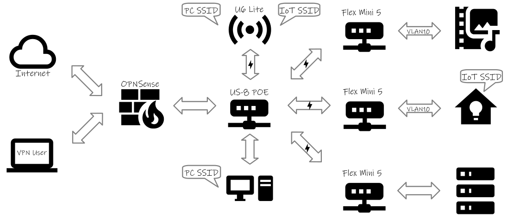

# UniFi + OPNSense
I like my UniFi access point and ethernet switches. I'm less impressed with their firewall/router offerings. So I have a comodity x86 machine running OPNSense. Mixing more than one ecosystem always comes with unique challenges. As I solve them, I'll post solutions here in hopes someone else may find the information useful.

## Network Topology

_Figure 1: Hastily constructed network diagram using [LibreOffice](https://www.libreoffice.org/) and [Material Design icons](https://pictogrammers.com/library/mdi/)._

### Physical Layout
My home network consists of an 8-port UniFi POE switch at its core.
* One POE port powers the U6 Lite access point
* The remaining three POE ports serve as uplinks for Flex Mini 5-port switches attached to home entertainment, home automation, and various Linux servers.
* Internet service comes through the WAN interface of the OPNSense firewall.

### Logical Layout
The network is segmented into two virtual networks (VLANs), tagged as #1 and #10. Routing is handled by the OPNSense firewall.
* VLAN 1 is the default VLAN and carries traffic for trusted devices like phones, laptops, and desktops. Basically, it's for any device with an Android, Linux, or Windows operating system that receives regular security updates. These devices also store personally identifiable data that should be kept secure.
* VLAN 10 is a tagged VLAN for home automation and home entertainment traffic. It's for devices with weak security, possibly out-of-date firmware or abandonware operating systems. This includes the "smart" TV, home theater receiver, smart thermostat, solar inverter, etc. These devices do not store personally identifiable data.
* The wireless access point has two SSIDs. The primary SSID is associated with the default VLAN 1 and used for PCs and other trusted devices. The secondary SSID is for untrusted IoT devices and is associated with VLAN 10.

## Setup Details
[IoT VLAN](iot.md) -- The first challenge I ran into was creating a separate network for Internet of Things (IoT) devices when my firewall only has two physical ethernet ports. The short answer is VLANs. For the details, see the guide.

[Firewall Rules](firewall.md) -- For a little insight into how I decided which devices should go where and how to control access via OPNSense, I've created this explanation of the process and the resulting rules.
